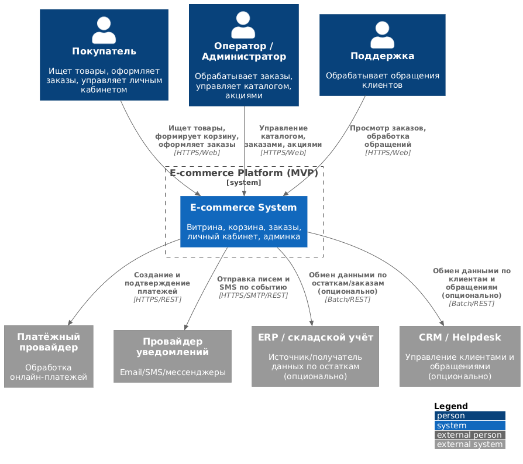
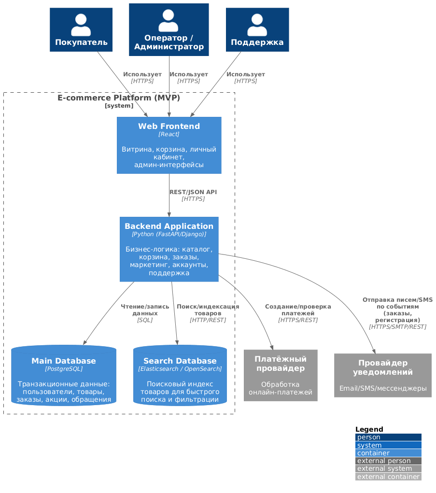
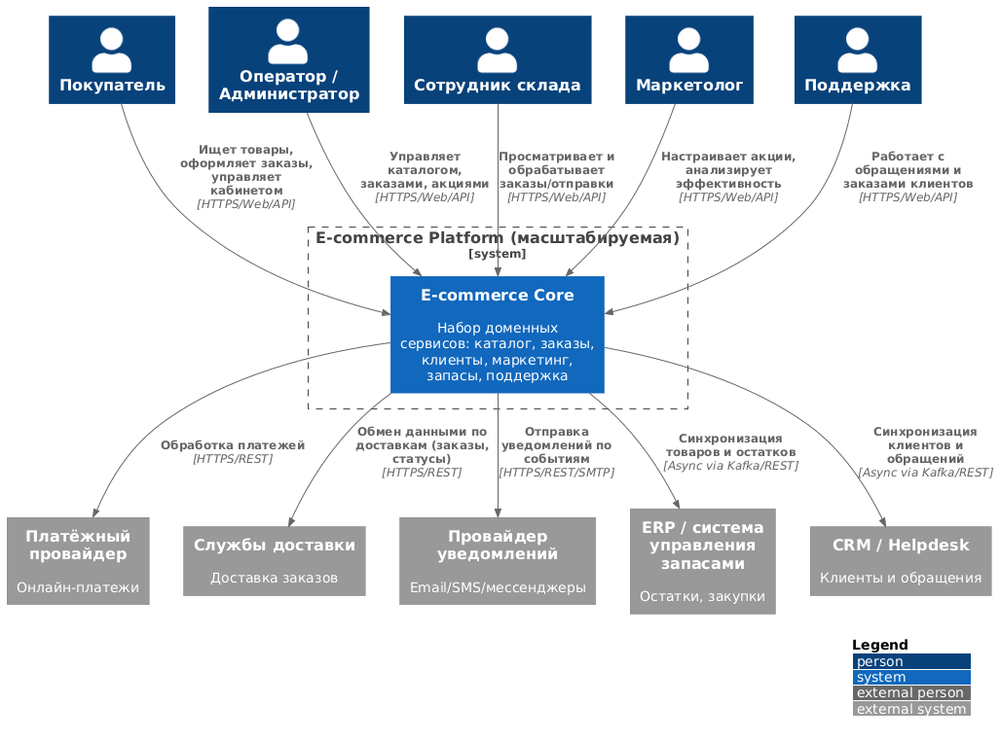
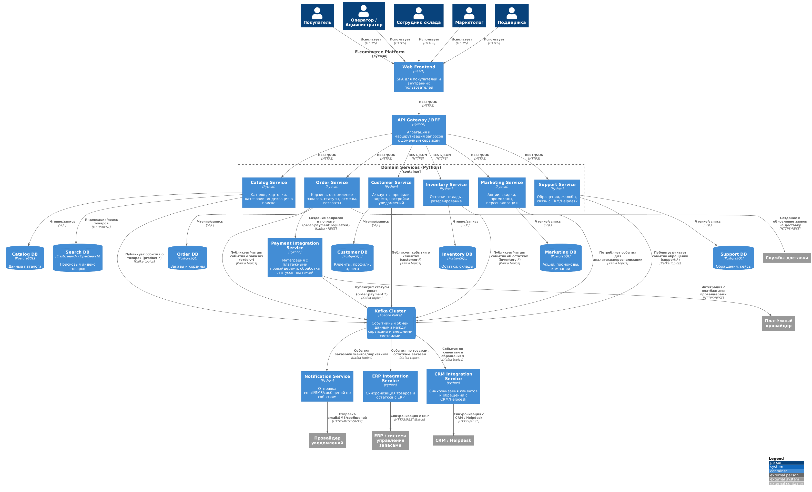
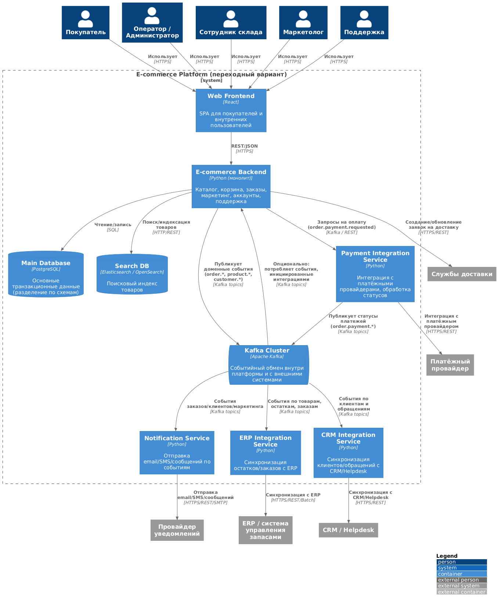

# C4 Диаграммы архитектуры

Этот каталог содержит C4-диаграммы архитектуры e-commerce системы в формате PlantUML и сгенерированные PNG-изображения.

Диаграммы разделены на три варианта архитектуры:
- **MVP** — монолитный backend + React + PostgreSQL + Search DB.
- **Переходный вариант** — монолит + Kafka + выделенные интеграционные сервисы.
- **Масштабируемая платформа** — набор доменных сервисов + Kafka.

> PNG-файлы генерируются автоматически из `.puml` через GitHub Actions (`.github/workflows/plantuml.yml`).

---

## 1. MVP

### C1 — Контекст

- Файл: `C1-mvp-ecommerce.puml`
- Изображение:

### C2 — Контейнеры

- Файл: `C2-mvp-ecommerce.puml`
- Изображение:

---

## 2. Масштабируемая платформа

### C1 — Контекст

- Файл: `C1-platform-ecommerce.puml`
- Изображение:

### C2 — Контейнеры

- Файл: `C2-platform-ecommerce.puml`
- Изображение:

---

## 3. Переходный вариант (монолит + Kafka)

### C2 — Контейнеры (переходная архитектура)

- Файл: `C2-transitional-ecommerce.puml`
- Изображение:

---

## 4. Как обновляются диаграммы

1. Вноси изменения только в `.puml` файлы.
2. Коммить и пушь изменения в репозиторий.
3. GitHub Actions workflow `plantuml.yml` автоматически:
    - найдёт все `.puml` в `docs/03-architecture/c4`,
    - сгенерирует `.png` рядом с ними,
    - закоммитит обновлённые изображения.

Таким образом `.puml` — это «исходный код» диаграмм, а `.png` — артефакты для просмотра на GitHub.
