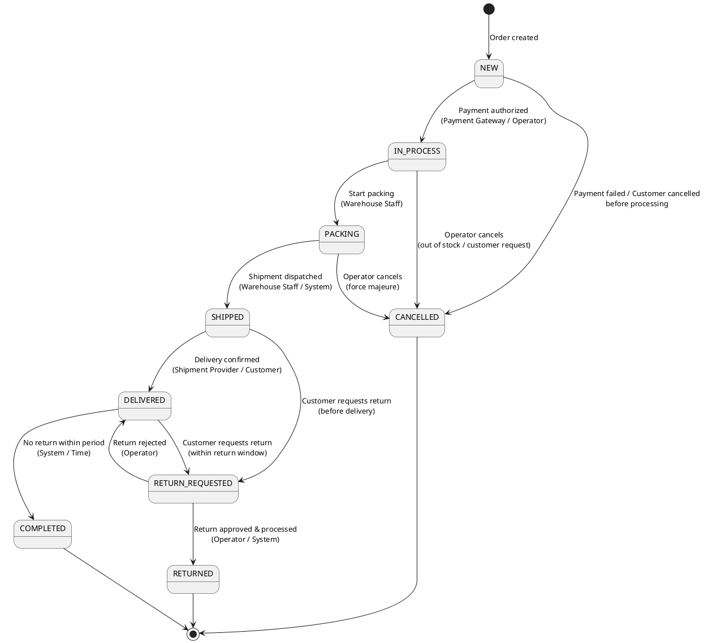
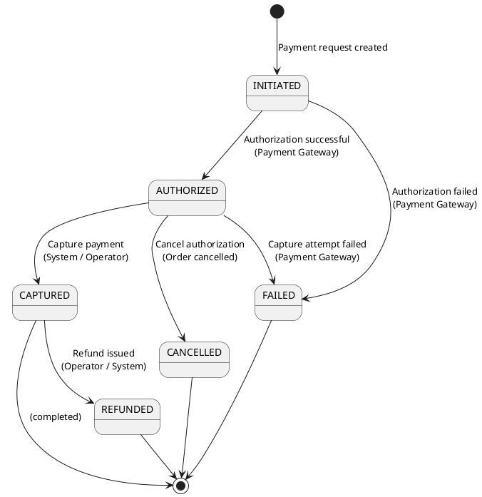
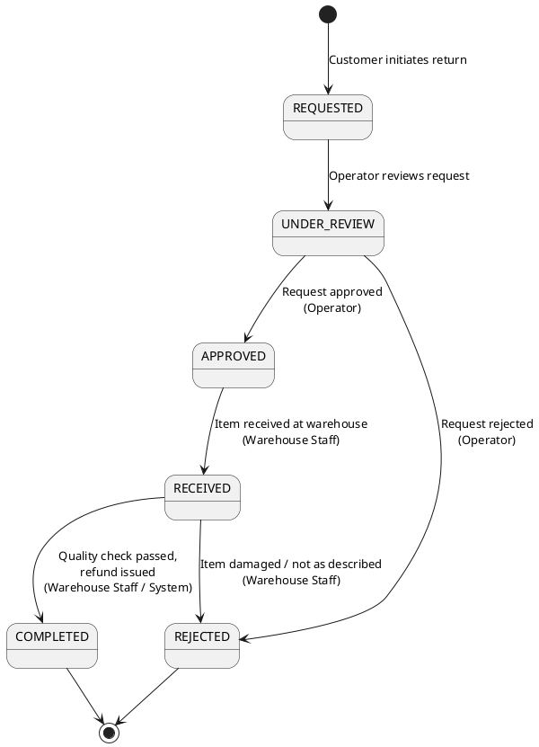
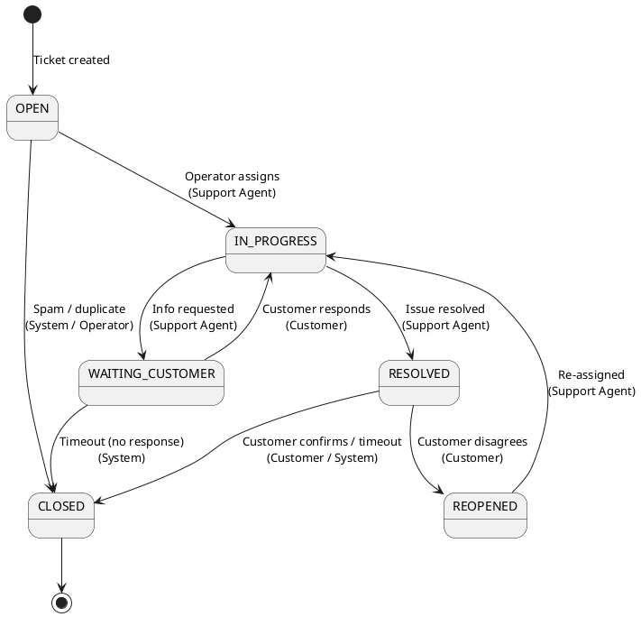
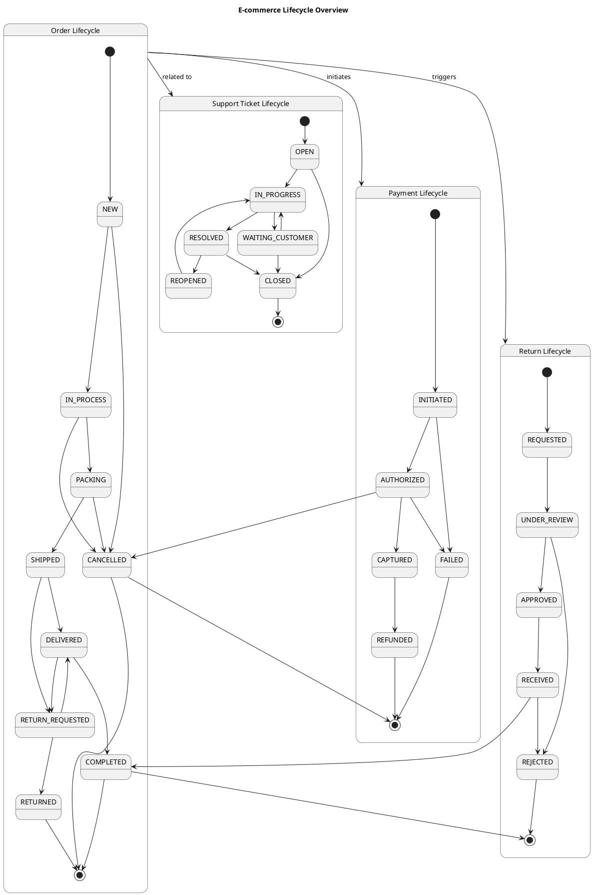

# Lifecycle & State Machines (E-commerce)

## 1. Обзор

Этот документ фиксирует жизненные циклы ключевых сущностей e‑commerce системы (заказы, платежи, возвраты, обращения в поддержку), включая:
- перечень статусов,
- допустимые переходы между статусами,
- инициаторов переходов (актёры и триггеры),
- бизнес‑правила и ограничения.

Документ дополняет **Business Requirements (BR)** и **System Requirements (SR)**, обеспечивая детальную спецификацию для реализации state machine логики в сервисах.

---

## 2. Жизненный цикл заказа (Order Lifecycle)

### 2.1. Перечень статусов

| Статус           | Код (enum)        | Описание                                                                 |
|------------------|-------------------|--------------------------------------------------------------------------|
| Новый            | `NEW`             | Заказ создан, ожидает подтверждения оплаты или начала обработки         |
| В обработке      | `IN_PROCESS`      | Заказ подтверждён, передан в операции для комплектации                   |
| Комплектуется    | `PACKING`         | Склад собирает заказ для отгрузки                                        |
| Отгружен         | `SHIPPED`         | Заказ передан в службу доставки, трекинг-номер присвоен                  |
| Доставлен        | `DELIVERED`       | Заказ получен клиентом                                                   |
| Завершён         | `COMPLETED`       | Заказ полностью закрыт, клиент не инициировал возврат в установленный срок |
| Отменён          | `CANCELLED`       | Заказ отменён (клиентом, оператором или системой)                        |
| Запрос возврата  | `RETURN_REQUESTED`| Клиент инициировал возврат части или всего заказа                        |
| Возвращён        | `RETURNED`        | Возврат обработан, товар вернулся на склад, средства возвращены           |

---

### 2.2. Диаграмма состояний (PlantUML State Machine)

---

### 2.3. Таблица переходов

| Из статуса         | В статус           | Инициатор                              | Условия / Правила                                                  |
|--------------------|--------------------|----------------------------------------|--------------------------------------------------------------------|
| `NEW`              | `IN_PROCESS`       | Payment Gateway / Operator             | Оплата авторизована или подтверждена                               |
| `NEW`              | `CANCELLED`        | Customer / System / Operator           | Оплата не прошла, клиент отменил до обработки, fraud detection     |
| `IN_PROCESS`       | `PACKING`          | Warehouse Staff / System               | Заказ передан на склад, все позиции доступны                       |
| `IN_PROCESS`       | `CANCELLED`        | Operator                               | Нехватка товара, запрос клиента, форс-мажор                        |
| `PACKING`          | `SHIPPED`          | Warehouse Staff / System               | Заказ собран, трекинг-номер присвоен, передан в доставку           |
| `PACKING`          | `CANCELLED`        | Operator                               | Форс-мажор, критическая ошибка, повреждение товара                 |
| `SHIPPED`          | `DELIVERED`        | Shipment Provider / Customer           | Доставка подтверждена провайдером или клиентом                     |
| `SHIPPED`          | `RETURN_REQUESTED` | Customer                               | Клиент инициировал возврат до получения (редкий случай)            |
| `DELIVERED`        | `COMPLETED`        | System (scheduled job)                 | Прошло N дней (например, 14), клиент не инициировал возврат        |
| `DELIVERED`        | `RETURN_REQUESTED` | Customer                               | Клиент инициировал возврат в течение установленного периода        |
| `RETURN_REQUESTED` | `RETURNED`         | Operator / System                      | Возврат одобрен, товар получен, средства возвращены                |
| `RETURN_REQUESTED` | `DELIVERED`        | Operator                               | Возврат отклонён (не соответствует политике, товар повреждён)      |

---

### 2.4. Бизнес‑правила

- **Отмена заказа клиентом**: доступна только в статусах `NEW` и `IN_PROCESS` (до начала `PACKING`). После этого требуется обращение в поддержку.
- **Период возврата**: устанавливается бизнес‑политикой (например, 14 дней с момента доставки). По истечении переход в `COMPLETED`.
- **Частичный возврат**: система должна поддерживать частичный возврат позиций. В этом случае заказ может иметь дополнительный атрибут `partiallyReturned`, но основной статус остаётся `DELIVERED` или переходит в `RETURN_REQUESTED` → `RETURNED` для возвращённых позиций.
- **История изменений**: каждый переход статуса фиксируется в истории заказа с timestamp, актёром и причиной.

---

## 3. Жизненный цикл платежа (Payment Lifecycle)

### 3.1. Перечень статусов

| Статус           | Код (enum)       | Описание                                                                 |
|------------------|------------------|--------------------------------------------------------------------------|
| Инициирован      | `INITIATED`      | Платёжная транзакция создана, запрос отправлен в платёжный шлюз         |
| Авторизован      | `AUTHORIZED`     | Средства заблокированы на счёте клиента, но не списаны                   |
| Захвачен         | `CAPTURED`       | Средства списаны и зачислены на счёт мерчанта                            |
| Неудачный        | `FAILED`         | Платёж не прошёл (отклонён банком, недостаточно средств, ошибка шлюза)   |
| Возвращён        | `REFUNDED`       | Средства полностью или частично возвращены клиенту                       |
| Отменён          | `CANCELLED`      | Авторизация отменена до capture (например, при отмене заказа)            |

---

### 3.2. Диаграмма состояний (PlantUML State Machine)

---

### 3.3. Таблица переходов

| Из статуса    | В статус      | Инициатор                    | Условия / Правила                                                    |
|---------------|---------------|------------------------------|----------------------------------------------------------------------|
| `INITIATED`   | `AUTHORIZED`  | Payment Gateway              | Авторизация успешна, средства заблокированы                          |
| `INITIATED`   | `FAILED`      | Payment Gateway              | Отклонено банком, недостаточно средств, ошибка шлюза                 |
| `AUTHORIZED`  | `CAPTURED`    | System / Operator            | Заказ подтверждён, средства списываются                              |
| `AUTHORIZED`  | `CANCELLED`   | System / Operator            | Заказ отменён до списания средств                                    |
| `AUTHORIZED`  | `FAILED`      | Payment Gateway              | Попытка capture не удалась (истёк срок авторизации, блокировка карты)|
| `CAPTURED`    | `REFUNDED`    | Operator / System            | Возврат товара, отмена услуги, корректировка суммы                   |

---

### 3.4. Бизнес‑правила

- **Двухэтапный платёж** (authorize → capture): используется для уменьшения рисков и возможности отмены до списания средств. Capture происходит после подтверждения наличия товара на складе.
- **Одноэтапный платёж**: при оплате наличными/постоплате платёж может сразу переходить в `CAPTURED` или обрабатываться как offline‑транзакция.
- **Частичный refund**: система должна поддерживать частичный возврат средств при частичном возврате товара. Статус остаётся `CAPTURED`, дополнительный атрибут `refundedAmount` отслеживает возвращённую сумму.
- **Timeout авторизации**: если capture не произошёл в течение N часов (зависит от платёжной системы, обычно 7–30 дней), авторизация автоматически аннулируется.
- **Idempotency**: все запросы на capture и refund должны быть идемпотентными с использованием `idempotency_key`.

---

## 4. Жизненный цикл возврата (Return Lifecycle)

### 4.1. Перечень статусов

| Статус           | Код (enum)           | Описание                                                                 |
|------------------|----------------------|--------------------------------------------------------------------------|
| Запрошен         | `REQUESTED`          | Клиент инициировал возврат товара                                        |
| На рассмотрении  | `UNDER_REVIEW`       | Оператор проверяет запрос на возврат (причина, сроки, состояние товара)  |
| Одобрен          | `APPROVED`           | Возврат одобрен, клиенту предоставлена инструкция по возврату товара     |
| Товар получен    | `RECEIVED`           | Товар получен на складе, проходит проверку качества                      |
| Завершён         | `COMPLETED`          | Возврат обработан, средства возвращены, товар оприходован                |
| Отклонён         | `REJECTED`           | Возврат отклонён (не соответствует политике, товар повреждён клиентом)   |

---

### 4.2. Диаграмма состояний (PlantUML State Machine)

---

### 4.3. Таблица переходов

| Из статуса       | В статус       | Инициатор              | Условия / Правила                                                  |
|------------------|----------------|------------------------|--------------------------------------------------------------------|
| `REQUESTED`      | `UNDER_REVIEW` | System / Operator      | Запрос на возврат зарегистрирован, передан оператору               |
| `UNDER_REVIEW`   | `APPROVED`     | Operator               | Запрос соответствует политике возврата, в пределах сроков          |
| `UNDER_REVIEW`   | `REJECTED`     | Operator               | Запрос не соответствует политике, истёк срок возврата              |
| `APPROVED`       | `RECEIVED`     | Warehouse Staff        | Товар физически получен на складе возврата                         |
| `RECEIVED`       | `COMPLETED`    | Warehouse Staff / Sys  | Товар прошёл проверку качества, средства возвращены клиенту        |
| `RECEIVED`       | `REJECTED`     | Warehouse Staff        | Товар повреждён клиентом / не соответствует описанию возврата      |

---

### 4.4. Бизнес‑правила

- **Сроки возврата**: устанавливаются бизнес‑политикой (например, 14 или 30 дней с момента доставки). Запросы за пределами срока автоматически переводятся в `REJECTED` или требуют одобрения менеджера.
- **Категории невозвратных товаров**: некоторые товары (например, нижнее бельё, косметика с нарушенной упаковкой) не подлежат возврату. Проверка на этапе `UNDER_REVIEW`.
- **Частичный возврат**: один заказ может содержать несколько возвратов по разным позициям, каждая со своим статусом. Рекомендуется моделировать как отдельные сущности `ReturnItem`.
- **Связь с платежом**: при `COMPLETED` автоматически инициируется `REFUND` в соответствующем Payment.
- **Обмен товара**: если клиент хочет обмен (не возврат денег), бизнес‑процесс может включать дополнительный статус `EXCHANGE_REQUESTED` и создание нового заказа.

---

## 5. Жизненный цикл обращения в поддержку (Support Ticket Lifecycle)

### 5.1. Перечень статусов

| Статус           | Код (enum)       | Описание                                                                 |
|------------------|------------------|--------------------------------------------------------------------------|
| Открыт           | `OPEN`           | Обращение создано, ожидает назначения оператору                          |
| В работе         | `IN_PROGRESS`    | Оператор взял обращение в работу, ведётся диалог с клиентом              |
| Ожидает клиента  | `WAITING_CUSTOMER`| Оператор запросил дополнительную информацию, ожидание ответа клиента     |
| Решён            | `RESOLVED`       | Проблема решена, оператор закрыл обращение                               |
| Закрыт           | `CLOSED`         | Обращение окончательно закрыто (клиент подтвердил или прошёл таймаут)    |
| Переоткрыт       | `REOPENED`       | Клиент не согласен с решением, обращение возвращено в работу             |

---

### 5.2. Диаграмма состояний (PlantUML State Machine)

---

### 5.3. Таблица переходов

| Из статуса          | В статус           | Инициатор              | Условия / Правила                                                  |
|---------------------|--------------------|------------------------|--------------------------------------------------------------------|
| `OPEN`              | `IN_PROGRESS`      | Support Agent          | Оператор взял обращение в работу                                   |
| `OPEN`              | `CLOSED`           | System / Operator      | Обращение определено как спам, дубликат или некорректное           |
| `IN_PROGRESS`       | `WAITING_CUSTOMER` | Support Agent          | Оператор запросил информацию у клиента                             |
| `IN_PROGRESS`       | `RESOLVED`         | Support Agent          | Оператор предоставил решение, проблема закрыта с его стороны       |
| `WAITING_CUSTOMER`  | `IN_PROGRESS`      | Customer               | Клиент ответил, оператор продолжает работу                         |
| `WAITING_CUSTOMER`  | `CLOSED`           | System                 | Клиент не ответил в течение N дней (например, 7), обращение закрыто|
| `RESOLVED`          | `CLOSED`           | Customer / System      | Клиент подтвердил решение или прошёл таймаут автозакрытия          |
| `RESOLVED`          | `REOPENED`         | Customer               | Клиент не согласен с решением, требует доработки                   |
| `REOPENED`          | `IN_PROGRESS`      | Support Agent / System | Обращение переназначено оператору для повторной обработки          |

---

### 5.4. Бизнес‑правила

- **SLA по первому ответу**: обращение в статусе `OPEN` должно быть взято в работу (`IN_PROGRESS`) в течение N часов (например, 4 часа в рабочее время).
- **SLA по разрешению**: обращение должно быть решено (`RESOLVED`) в течение M часов/дней в зависимости от приоритета и типа (например, 24 часа для критичных, 72 часа для стандартных).
- **Автоматическое закрытие**: если в статусе `RESOLVED` клиент не отреагировал в течение N дней (например, 3 дня), обращение автоматически переходит в `CLOSED`.
- **Переоткрытие**: клиент может переоткрыть обращение в течение определённого периода после `CLOSED` (например, 7 дней). После этого требуется создание нового обращения.
- **Категории обращений**: обращения могут быть категоризированы (вопрос по заказу, технический вопрос, жалоба, предложение). Категория влияет на маршрутизацию и приоритет.
- **Связь с заказом**: если обращение связано с конкретным заказом, система должна отображать детали заказа и его текущий статус для оператора.

---

## 6. Интеграция жизненных циклов

### 6.1. Связь Order ↔ Payment

- Создание заказа инициирует создание платежа в статусе `INITIATED`.
- Успешная авторизация платежа (`AUTHORIZED`) переводит заказ из `NEW` в `IN_PROCESS`.
- Отказ платежа (`FAILED`) переводит заказ в `CANCELLED`.
- Capture платежа (`CAPTURED`) происходит после перехода заказа в `PACKING` или `SHIPPED` (в зависимости от бизнес‑политики).
- Возврат средств (`REFUNDED`) инициируется при переходе заказа в `RETURNED`.

---

### 6.2. Связь Order ↔ Return

- Переход заказа в `RETURN_REQUESTED` инициирует создание сущности Return в статусе `REQUESTED`.
- Завершение возврата (`COMPLETED`) переводит заказ в `RETURNED`.
- Отклонение возврата (`REJECTED`) возвращает заказ в `DELIVERED`.

---

### 6.3. Связь Order ↔ SupportTicket

- Клиент может создать обращение в поддержку по конкретному заказу на любом этапе его жизненного цикла.
- Обращения в поддержке не изменяют статус заказа напрямую, но могут инициировать действия оператора (отмена заказа, возврат и т.п.).
- В карточке обращения отображается текущий статус заказа для контекста.

---

## 7. PlantUML: Сводная диаграмма состояний (все сущности)

---

## 8. Рекомендации по реализации

1. **State Machine Engine**: использовать специализированные библиотеки для управления состояниями (например, Spring State Machine для Java, XState для JavaScript/TypeScript).
2. **Event Sourcing**: рассмотреть паттерн Event Sourcing для хранения истории переходов как последовательности событий (особенно для Order и Payment).
3. **Saga Pattern**: для распределённых транзакций (например, Order + Payment + Inventory) использовать Saga для координации и компенсирующих транзакций.
4. **Audit Log**: каждый переход статуса фиксировать в audit log с timestamp, актёром, причиной и контекстом.
5. **Валидация переходов**: на уровне API и бизнес‑логики жёстко контролировать допустимые переходы, возвращать ошибки при попытке недопустимых переходов.
6. **Timeout & Scheduler**: использовать планировщики для автоматических переходов по таймауту (например, `DELIVERED` → `COMPLETED`, `WAITING_CUSTOMER` → `CLOSED`).

---

## 9. Связь с требованиями

Этот документ детализирует следующие требования:
- **BR-ORD-01..05** (управление заказами, статусы, отмена, возвраты, история)
- **BR-CHK-02, BR-CHK-04, BR-CHK-06** (корректность данных заказа, способы оплаты, подтверждение)
- **BR-SUP-02** (управление обращениями в поддержку)
- **SR-ORD-01..08** (просмотр, отмена, возврат, управление статусами, история)
- **SR-CHK-07, SR-CHK-08** (регистрация заказа, подтверждение)
- **SR-SUP-04** (регистрация и учёт обращений)
- **NFR-OBS-01** (логирование ключевых событий, в том числе переходов статусов)

---

**Версия**: 1.0  
**Дата**: 2026-03-05  
**Авторы**: Architecture Team
